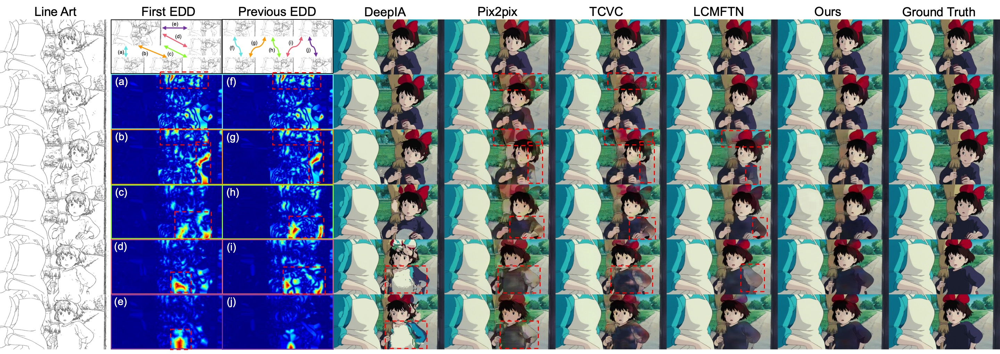
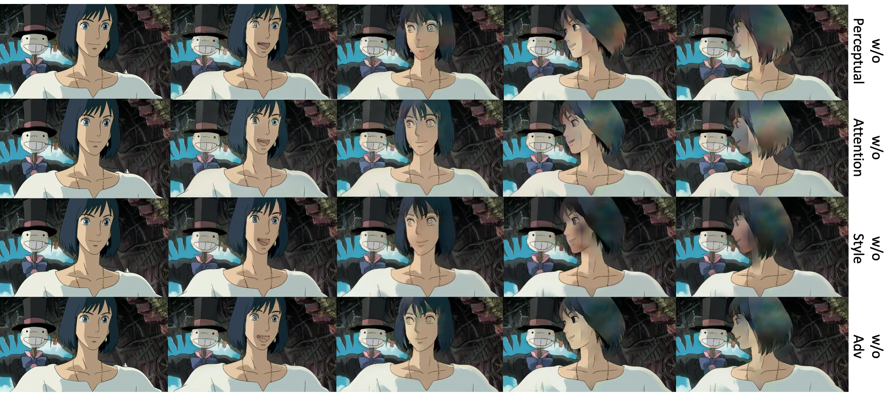

# Anime-Line-Art-Video-Colorization-with-Transformation-Region-Enhancement-Network
Anime Line Art Video Colorization with Transformation Region Enhancement Network.

# Videos

From left to right: **GT**, **Ours**, **LCMFTN**, **DeepIA**, **TCVC**, **Pix2pix**

Corresponding videos can be found in `./video`.

## experiment results

### Quantitative Results

#### Quantitative comparison against previous methods

Average

| Methods | SSIM       | PSNR        | FID         | Speed(fps) |
| ------- | ---------- | ----------- | ----------- | ---------- |
| Pix2pix | 0.8503     | 23.5124     | 51.8361     | 34.5       |
| DeepIA  | 0.7710     | 19.2700     | 41.9859     | 0.1        |
| TCVC    | 0.8569     | 23.5152     | 49.7201     | 17.8       |
| LCMFTN  | 0.9028     | 24.7321     | 40.6315     | 8.3        |
| Ours    | **0.9161** | **26.5381** | **29.0774** | 11.8       |

Large Geometric Transform

| Methods | SSIM       | PSNR        | FID         |
| ------- | ---------- | ----------- | ----------- |
| Pix2pix | 0.8249     | 21.9459     | 61.1170     |
| DeepIA  | 0.7516     | 18.3973     | 63.9546     |
| TCVC    | 0.8359     | 22.0108     | 59.2112     |
| LCMFTN  | 0.8842     | 22.6754     | 61.9384     |
| Ours    | **0.9008** | **24.3673** | **41.8511** |

Small Geometric Transform

| Methods | SSIM       | PSNR        | FID         |
| ------- | ---------- | ----------- | ----------- |
| Pix2pix | 0.8751     | 25.0328     | 60.9883     |
| DeepIA  | 0.7897     | 20.1169     | 43.4199     |
| TCVC    | 0.8773     | 24.9730     | 58.5699     |
| LCMFTN  | 0.9210     | 26.7304     | 39.7880     |
| Ours    | **0.9309** | **28.6405** | **27.0080** |

Long(>25 frames)

| Methods | SSIM       | PSNR        | FID         |
| ------- | ---------- | ----------- | ----------- |
| Pix2pix | 0.8517     | 23.3961     | 75.3350     |
| DeepIA  | 0.7754     | 19.0112     | 54.5747     |
| TCVC    | 0.8559     | 23.2621     | 51.4965     |
| LCMFTN  | 0.9057     | 24.5900     | 50.8006     |
| Ours    | **0.9181** | **26.3066** | **34.2663** |

Short(≤25 frames)

| Methods | SSIM       | PSNR        | FID         |
| ------- | ---------- | ----------- | ----------- |
| Pix2pix | 0.8486     | 23.6627     | 52.4313     |
| DeepIA  | 0.7651     | 19.6041     | 53.8086     |
| TCVC    | 0.8581     | 23.8310     | 49.8272     |
| LCMFTN  | 0.8992     | 24.9172     | 52.4559     |
| Ours    | **0.9135** | **26.8245** | **35.5569** |

#### Quantitative comparison for loss ablation

| Methods        | SSIM       | PSNR        | FID         |
| -------------- | ---------- | ----------- | ----------- |
| w/o perceptual | 0.8936     | 24.6892     | 34.3820     |
| w/o attention  | 0.8925     | 24.5670     | 35.4587     |
| w/o adv        | 0.9017     | 24.9754     | 35.1824     |
| w/o style      | 0.9140     | 25.8872     | 35.7982     |
| Ours           | **0.9161** | **26.5381** | **29.0774** |

#### Quantitative comparison for module ablation

| Methods              | SSIM   | PSNR    | FID     |
| -------------------- | ------ | ------- | ------- |
| Baseline             | 0.9009 | 24.9716 | 33.6961 |
| Baseline + RLM       | 0.9031 | 25.1274 | 32.1742 |
| Baseline + RLM + FEM | 0.9161 | 26.5381 | 29.0774 |

#### Results for our proposed modules with the previous network backbones.

| Methods           | SSIM            | PSNR             | FID               |
| ----------------- | --------------- | ---------------- | ----------------- |
| Pix2pix(+RLM+FEM) | 0.8866(+0.0363) | 23.8951(+0.3827) | 40.9842(-10.8519) |
| TCVC(+RLM+FEM)    | 0.8961(+0.0392) | 24.5637(+1.0485) | 37.6771(-12.0430) |
| LCMFTN(+RLM+FEM)  | 0.9102(+0.0074) | 25.4081(+0.6760) | 34.1774(-6.4541)  |

### Qualitative Results

#### Qualitative Comparison against previous methods

#### Qualitative Comparison for ablation experiments

